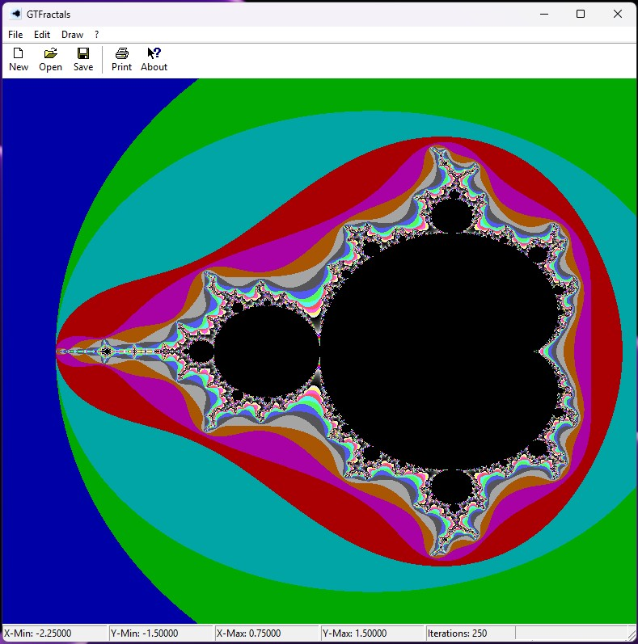

# GTFractals

GTFractals is a simple **Mandelbrot** and **Julia set viewer**, written in **C++** using the **Win32 API**. This project started as a personal experiment, driven by my passion for **retrocomputing** and my desire to revisit technologies I hadn’t used in a long time.

## 🎮 **A Project Born as a Game**
I've been programming fractal generators since **1992**, when I wrote my first program to render Mandelbrot and Julia sets. After many years, I decided to return to this old passion, using **classic tools and languages** like C++ and the **Win32 API**—technologies I had not worked with for quite some time.

GTFractals **is not intended to be a professional tool**. Instead, it is a personal project that brings back the joy of low-level programming, without relying on heavy frameworks or external dependencies.

## 💡 **Why This Project?**
- **Retrocomputing**: The charm of coding "the old way."
- **Win32 API & Visual C++**: Rediscovering native Windows programming.
- **Fractals**: The mathematical beauty of Mandelbrot and Julia sets.
- **Passion**: A personal hobby that I hope others may find interesting.

## 🚀 **Features**
- Generates **Mandelbrot and Julia sets**.
- Interactive zooming on the Mandelbrot set.
- Seamless switching between Mandelbrot and Julia sets.
- Lightweight, minimalistic interface with no external dependencies.
- Fully developed in **Visual C++**, targeting Windows (x86, x64, ARM and ARM64).

## 🛠️ **Building the Project**
GTFractals is designed to be built using **Microsoft Visual Studio**, specifically with **Visual C++**.

### **🔧 Building with Visual Studio**
1. **Install Visual Studio 2022** (or a compatible version).
2. Ensure that the **"Desktop development with C++"** workload is installed.
3. Open the `GTFractals.sln` solution file.
4. Select the `Release` or `Debug` configuration.
5. Build and run.

✅ No external dependencies are required. The project relies solely on **Win32 API and GDI** for rendering.

## 📷 **Screenshot**
Here’s a preview of the application:

## 🌍 **Contributions & Feedback**
GTFractals is a **personal project**, but if anyone finds it interesting, that would make me happy! 😊  
If you'd like to **improve it**, feel free to **contribute** with new features or optimizations.  

📩 **If you have any questions or suggestions, feel free to open an issue or reach out!**  

---

### **📜 License**
This project is released under the **MIT License**, so feel free to modify and share it.

---

Thanks for checking it out! 🚀  
Enjoy exploring **fractals!** ✨  
